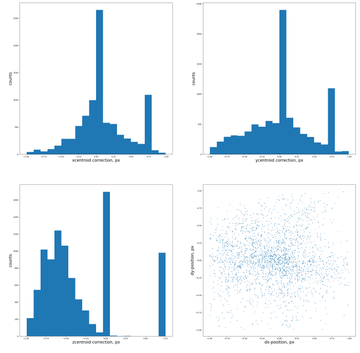
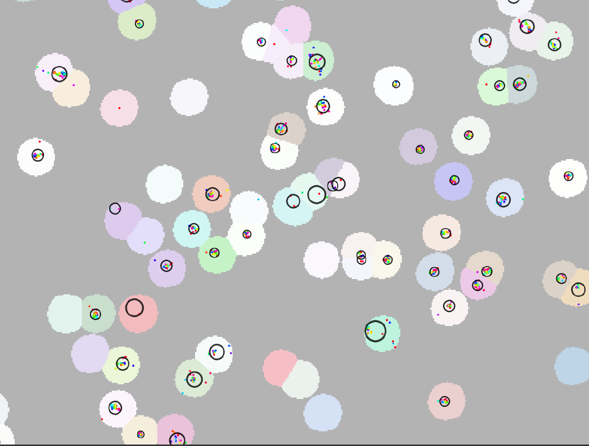
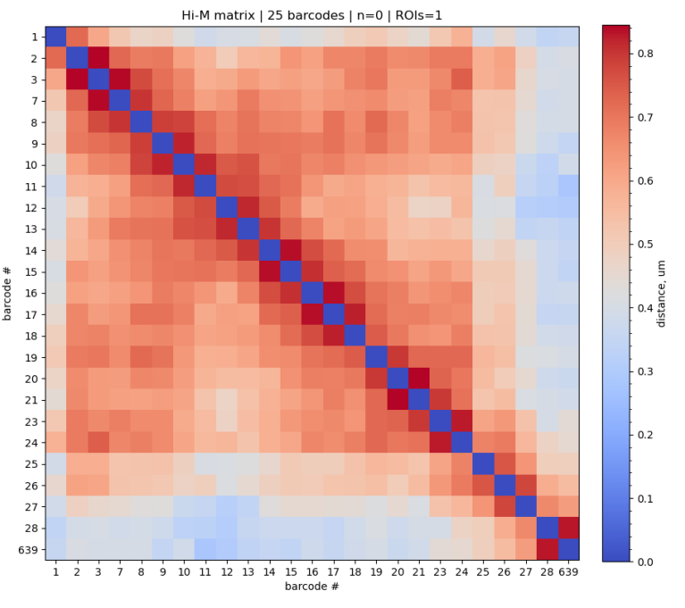
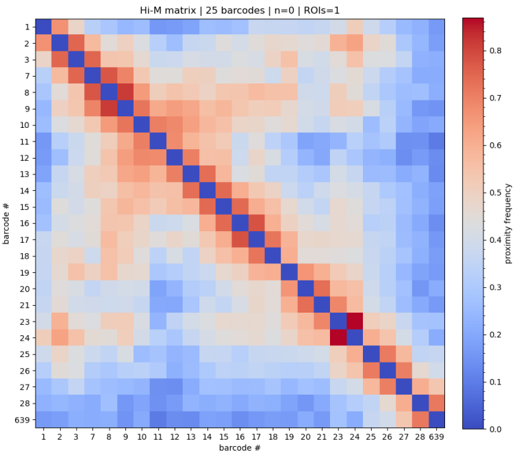
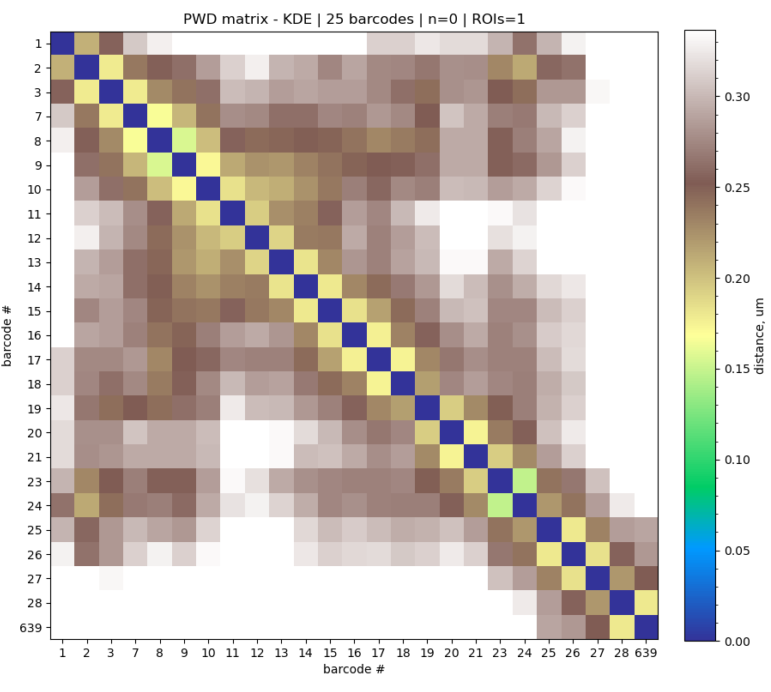
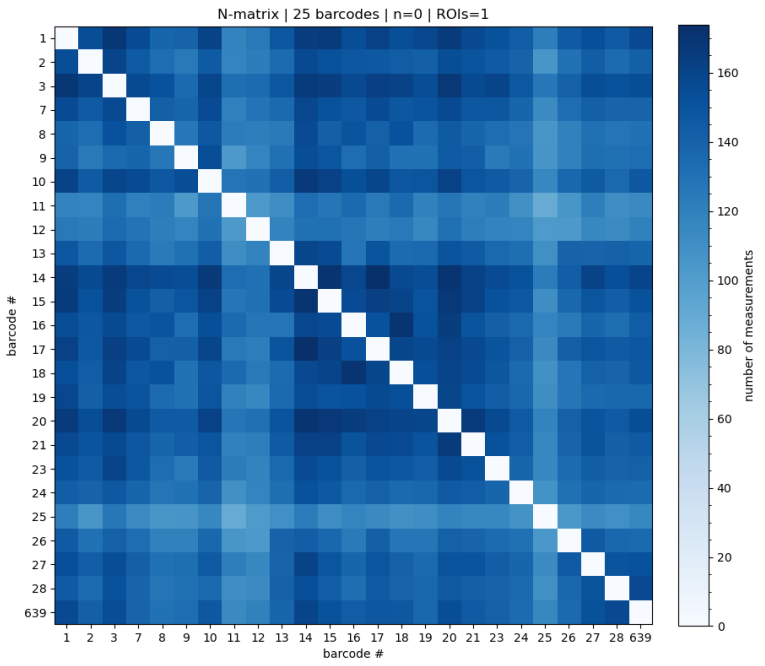

# WIP - pyHiM fundamentals

**TODO**
- Reorganise file

## Pipeline overview
### Default pyHiM flow

To run default pipeline, pyHiM need two kind of data :
- A dictionary of initialization parameters as a JSON file, name `infoList.json`
- 3D images with TIFF format, 4 types of images are accepted and they are processed in this order :
	1. Fiducial
	2. Barcode
	3. Mask (like DAPI)
	4. RNA

These types of images are called **labels**.

Steps of pipeline are executed sequentially in this order :

1. **makeProjections** : Projects all 3D images in 2D 
2. **alignImages** : Compute the best shift to align all 2D fiducials.
3. **appliesRegistrations** : Shifts 2D barcodes, masks and RNA with result of alignImages step.
4. **alignImages3D** : Takes 2D aligned fiducials and find the best shift on Z-axis. This shift will be apply on the 3D segmented barecodes at buildHiMmatrix step.
5. **segmentMasks** : Segments 2D aligned barcodes and masks with two different ways for each.
6. **segmentSources3D** : Applies 2D shift, computed at alignImages step, to 3D barcodes. Then, segments them in 3D.
7. **buildHiMmatrix** : Filters the segmentation results, associates barcode coordinates with the good mask and makes the PWD matrix for each mask.

But there are specific routines for specific labels, so this is the real running order :

|Command|Fiducial|Barcode|DAPI|RNA|
|:-:|:-:|:-:|:-:|:-:|
|makeProjections|1|4|8|12|
|alignImages|2||||
|appliesRegistrations||5|9|13|
|alignImages3D|3||||
|segmentMasks||6|10||
|segmentSources3D||7|||
|buildsPWDmatrix|||11||

### Input / Output data

Here is a table summarizing the type of input and output data for each routine :

|Routine|Input|Output|
|:-:|---|---|
|**makeProjections**|3D_raw.tif|2D_raw.npy|
|**alignImages**|2D_raw.npy + 2D_reference.npy|alignImages.ecsv|
|**AppliesRegistrations**|2D_raw.npy + alignImages.ecsv|2D_registered.npy|
|**alignImages3D**|3D_raw.tif + 3D_reference.tif + alignImages.ecsv|alignImages_block3D.ecsv|
|**segmentMasks**|2D_registered.npy|segmented_barecode.ecsv + segmented_mask.npy|
|**segmentSources3D**|3D_raw.tif + alignImages.ecsv|3D_segmented_barcode.ecsv|
|**buildHiMmatrix**|segmented_barcode.ecsv + segmented_mask.npy + alignImages_block3D.ecsv + 3D_segmented_barcode.ecsv|PWDMatrix.ecsv + 3D_PWDMatrix.ecsv|

### Flowchart of labels
```{mermaid}
flowchart TD
	subgraph graph legend
		Z1((feature))
		Z2([initial data])
		Z3[I/O data]
	end 
```

#### Fiducial flow

```{mermaid}
flowchart
	
	Fidu([3D_Fiducials])

	routine1bis((makeProjections))
	routine2((alignImages))
	routine4((alignImages3D))
	
	zProj0bis[3D_raw.tif]
	zProj1bis[2D_raw.npy]
	zProj2[2D_reference.npy]
	zProj3[3D_reference.npy]
	
	align1[alignImages.ecsv]
	align2[alignImages_block3D.ecsv]

	Fidu --> zProj0bis
	zProj0bis -->
	routine1bis --> 
	zProj1bis --> zProj2
	zProj1bis & zProj2 --> 
	routine2  --> align1
	
	zProj0bis --> zProj3
	zProj3 --> routine4
	zProj0bis --> routine4
	align1 -.-> routine4
	routine4 --> align2
	
	
	


```

#### Barcode flow
```{mermaid}
flowchart
	
	Barc([3D_Barcodes])

	routine1((makeProjections))
	routine3((appliesRegistrations))
	routine5((segmentMasks))
	routine6((segmentSources3D))
	
	zProj0[3D_raw.tif]
	zProj1[2D_raw.npy]
	
	align1[alignImages.ecsv]
	align3[2D_registered.npy]
	
	seg2[segmentedObjects_barcode.ecsv]
	seg3[segmentedObjects_3D_barcode.ecsv]

	align1 --> routine3
	
	Barc -->
	zProj0 -->
	routine1 -->
	zProj1 --> routine3
	
	routine3 --> align3
	
	
	align3 --> 
	routine5 --> seg2
	
	align1 --> routine6
	Barc --> routine6
	routine6 --> seg3
	
	


```
#### Mask flow
```{mermaid}
flowchart
	
	DAPI([3D_Masks])

	routine1((makeProjections))
	routine3((appliesRegistrations))
	routine5((segmentMasks))
	routine7((buildHiMmatrix))
	
	zProj0[3D_raw.tif]
	zProj1[2D_raw.npy]
	
	align1[alignImages.ecsv]
	align2[alignImages_block3D.ecsv]
	align3[2D_registered.npy]
	
	seg1[Masks.npy]
	seg2[segmentedObjects_barcode.ecsv]
	seg3[segmentedObjects_3D_barcode.ecsv]
	
	build1[PWDMatrix.ecsv]
	build2[3D_PWDMatrix.ecsv]


	align1 --> routine3
	
	DAPI -->
	zProj0 -->
	routine1 -->
	zProj1 --> routine3
	
	routine3 --> align3
	
	
	align3 --> 
	routine5 --> seg1
	
	
	align2 -.-> routine7
	seg1 & seg2 & seg3 --> routine7
	
	routine7 --> build1 & build2
	routine7 <--> matching
	subgraph matching
		matching1[HiMscMatrix.npy]
		matching2[3D_HiMscMatrix.npy]
		matching3[Nmatrix.npy]
		matching4[3D_Nmatrix.npy]
		matching7[uniqueBarcodes.ecsv]
		matching8[3D_uniqueBarcodes.ecsv]
	end


```
#### RNA flow
```{mermaid}
flowchart
	
	RNA([3D_RNA])

	routine1((makeProjections))
	routine3((appliesRegistrations))
	
	zProj0[3D_raw.tif]
	zProj1[2D_raw.npy]
	
	align1[alignImages.ecsv]
	align3[2D_registered.npy]

	align1 --> routine3
	
	RNA -->
	zProj0 -->
	routine1 -->
	zProj1 --> routine3
	
	routine3 --> 
	align3 --> 
	rout4((processSNDchannel.py)) -->
	proc1[SNDassignedCells.ecsv]
```

## Main features
### makeProjections
*Projects 3D images in 2D*

Initialization parameters :

 |Name|Option|Description|
 |:-:|:-:|:-:|
 |mode|manual|Assign plans between *zmin* and *zmax* to "zRange"|
 ||automatic|Estimates the focal plane using the maximum standard deviation plane by plane. Use *zwindows* to set "zRange" arround this focal plane.|
 ||full|Assign all plans to "zRange"|
 ||laplacian|Split 3D image into blocks of the size given by *blockSize*. Find Laplacian Variance maximum (blur estimation) for each block in order to estimate the focal plane. Rebuild block-by-block 2D image with optimal focal plane of each block. if *zwindows* option is activated, project each block with MIP option.|
 |windowSecurity||Used for *automatic* mode, removes the lowest and highest Z-plans.|
 |zProjectOption|sum|Sum plans in "zRange"|
 ||MIP|Maximum Intensity Projection of plans in "zRange"|

This routine take all 3D images and project its in 2D.
Depending on the chosen *mode*, this feature start to find the good set of Z-plans, where there is the least noise. This step give a range centered on a focal plan, named *zRange*. After, projection is done on this range either by sum or by maximum intensity projection.

```{mermaid}
flowchart TD

		A1[["zProjectionRange()"]] --> A2
		A1 --> A3
		A1 --> A4
		A1 --> A5
		A2[manual] ---> A7
		A3[automatic] --> A6
		A4[full] ---> A7
		A5[laplacian] --> A8
		A6[["calculate_zrange()"]] --> A7
		A7([zRange]) --> A9
		A8[["reinterpolatesFocalPlane()"]] ----> A10
		A8 ---> A9
		A9[["projectsImage2D()"]] --> A14
		A9 --> A15
		subgraph OUTPUT
			A10([focalPlaneMatrix])
			subgraph common
				A11([data_2D])
				A12(["focusPlane"])
				A13([zRange])
			end
		end
		A14[MIP] --> common
		A15[sum] --> common
		subgraph INPUT
			K([3D_DAPI])
			M([3D_Fiducials])
			N([3D_RNA])
			L([3D_Barcodes])
		end
		INPUT --> A1

```

### alignImages
*Registers fiducials using a barcode as reference*

In the set of *fiducial* images, one is chosen by initialization parameters to be the reference. 
The algorithm takes images one by one and align with the reference.
There are two ways to compute the shift :
- Global alignement make simple cross-correlation with tow images
- Split image in block and make cross-correlation block by block. Then we have one shift by block and to align the global image an average of those shifts are made. This method is more robust against a bright noise spot.
```{mermaid}
flowchart TD

		subgraph A[INPUT]
			A1([2D_Fiducials])
			A2([imReference])
		end
		subgraph C[OUTPUT]
			C1([alignmentResultsTable.ecsv])
			C2(["shift[X][Y]"])
			C3([image2_corrected_raw])
		end
		A1 --> B1
		A2 --> B1
		B1[["align2Files()"]] --> B2
		B1 --> B3
		B2[global alignment] --> B5
		B3[alignByBlock] --> B4
		B4[["alignImagesByBlocks()"]] --> B6
		B5[["align2ImagesCrossCorrelation()"]] --> B6
		B6([shift]) --> B7
		B6 --> C1
		B6 --> C2
		B7[["shiftImage()"]] --> C3

```

### AppliesRegistrations
*Applies registration to DAPI and barcodes*
```{mermaid}
flowchart TD

		subgraph A[INPUT]
			A1([2D_DAPI])
			A2([2D_RNA])
			A3([2D_Barcodes])
			A4([dictShifts])
		end
		subgraph C[OUTPUT]
			C1([aligned_2D_DAPI])
			C2([aligned_2D_RNA])
			C3([aligned_2D_Barcodes])
		end
		A --> B1
		B1[["appliesRegistrations2fileName()"]] --> C
	
```

### alignImages3D
*Aligns fiducials in 3D*
This feature run for *fiducial* images and with "block3D" value for "localAlignment" key in *infoList.json* file.
```{mermaid}
flowchart TD

		subgraph A[INPUT]
			A1([3D_Fiducials])
			A2([reference list])
		end
		subgraph C[OUTPUT]
			C1([ECSV table with all shifts])
			C2([aligned_3D_Fiducials])
		end
		A --> B1
		B1[["alignFiducials3Dfile()"]] --> B3
		B1 --> B2
		B2([shift]) --> B3
		B3[["appliesXYshift3Dimages()"]] --> B4
		B4[["imageBlockAlignment3D()"]] --> C
	
```
### segmentMasks
*Segments DAPI and sources in 2D*
```{mermaid}
flowchart TD

		subgraph A[INPUT]
			A1([aligned_2D_DAPI])
			A2([aligned_2D_Barcodes])
		end
		subgraph C[OUTPUT]
			C1([Table with barcode coordinates])
			C2([Numpy array with segmented masks])
		end
		A --> B1
		B1[["segmentMasks()"]] --> B2
		B2[["makesSegmentations()"]] --> B3
		B2 --> B4
		B3[barcode] --> B5
		B3 --> B6
		B4[DAPI] --> B9
		B4 --> B10
		B4 --> B11
		B4 ----> B14
		B5[flat] --> B7
		B6[inhomogeneous] --> B8
		B7[["segmentSourceFlatBackground()"]] ---> C
		B8[["segmentSourceInhomogBackground()"]] ---> C
		B9[flat] --> B12
		B10[inhomogeneous] --> B12
		B11[stardist] --> B13
		B12[["segmentMaskInhomogBackground()"]] ---> C
		B13[["segmentMaskStardist()"]] ---> C
		B14[tesselation] --> C
		
	
```

### segmentSources3D
*Segments sources in 3D*

```{mermaid}
flowchart TD

		subgraph A[INPUT]
			A1([3D_Barcodes])
			A2([shift table])
		end
		subgraph C[OUTPUT]
			C1([ECSV table with barcode coordinates in 3D])
		end
		A1 --> B1
		A2 --> B5
		B1[["segmentSources3D_file()"]] --> B2
		B1 --> B3
		B2[stardist] ---> B5
		B3[not stardist] --> B4
		B4[["preProcess3DImage()"]] --> B5
		B5[["appliesXYshift3Dimages()"]] --> B6
		B6([aligned_3D_Barcodes]) --> B7
		B6 --> B8
		B7[["_segments3Dvolumes_StarDist()"]] --> B9
		B8[["_segments3DvolumesByThresholding()"]] --> B9
		B9([segmentedImage3D]) --> B10
		B10[["getMaskProperties()"]] --> B11
		B11([spots]) --> B12
		B12[["bigfish.fit_subpixel()"]] --> B13
		B13([spots_subpixel]) --> C
		
	
```

### 5. Building chromatin traces

#### 5.1 Build traces: new method

The new method requires executing several modules:

- `filter_localizations`
- `register_localizations`
- `build_traces`
- `build_matrices`


##### 5.1.1 `filter_localizations`


**Invoke**

To run this function exclusively, run *pyHiM* using the ```-C filter_localizations``` argument. This function will find and process all the localization files in the `segmentedObjects` folder. To avoid overwriting data, existing files will be renamed with the extension `_version_n` where `n`will be incremented from run to run. The output of `filter_localizations` will be saved with the original localizations filename. A comment in the header will be added to indicate that a *filtering* operation was run on this file.


**Relevant options**

Parameters to run this script will be read from the ```buildsPWDmatrix``` field of ```infoList.json```.

```
"flux_min": 10, # maximum flux allowed for 2D
"flux_min_3D": 4000,# maximum flux allowed for 3D
```


**Output images**

- `_filtered_barcode_localizations_ROI*.png`


##### 5.1.2 `register_localizations`


**Invoke**

To run this function exclusively, run *pyHiM* using the ```-C register_localizations``` argument. This function will find and process all the localization files in the `segmentedObjects` folder. To avoid overwriting data, existing files will be renamed with the extension `_version_n` where `n`will be incremented from run to run. The output of `register_localizations` will be saved with the original localizations filename. A comment in the header will be added to indicate that a *registration* operation was run on this file. `register_localizations` **will not be run on files that were previously registered.**


**Relevant options**

Parameters to run this script will be read from the ```buildsPWDmatrix``` field of ```infoList.json```.

```
"toleranceDrift": 1 # tolerance drift in pixels. Above this value localizations will not be locally registered
```


outputs images:

- `_registered_barcode_stats.png`
- `_registered_barcode_localizations_ROI*.png`

| statistics of registration                                   | localization map                                             |
| ------------------------------------------------------------ | ------------------------------------------------------------ |
|  |  |
|  |  |


##### 5.1.3 `build_traces`


**Invoke**

To run this function exclusively, run *pyHiM* using the ```-C build_traces``` argument. This function will find and process all the localization files in the `segmentedObjects` folder. The output of `register_localizations` will be saved in the `buildsPWDmatrix` folder with the name starting with `Trace_`. The reminder of the name will contain the kind of operation run (mask/KDtree) the identity of the mask (e.g. mask0, DAPI), and whether localizations used were from a *2D* or a *3D* analysis. 


**Relevant options**

Parameters to run this script will be read from the ```buildsPWDmatrix``` field of ```infoList.json```.

```
"tracing_method": ["masking","clustering"], # list of methods it will use
"mask_expansion": 8,# number of pixels masks will be expanded to assign localizations
"masks2process":{"nuclei":"DAPI","mask1":"mask0"}, # masks identities to process
"KDtree_distance_threshold_mum": 1,# threshold distance used for KDtree clustering
```


Output images:

- `_XYZ_ROI*.png`

|  | full image | zoomed images |
| --- |   ---- | --- |
| 3D **mask** |  ||
| 3D **mask** |  ||
| 3D **KDtree** |  ||


##### 5.1.4 `build_matrices`


**Invoke**

To run this function exclusively, run *pyHiM* using the ```-C build_matrix``` argument. This function will find and process all the `Trace_` files in the `buildsPWDmatrix` folder. The outputs of `build_matrix` will be saved in the `buildsPWDmatrix` folder. Output files will be created with the root filename of `Trace_`files. They will contain Numpy arrays with single cell PWD matrices  (`_PWDscMatrix.npy`) and N-matrices (`_Nmatrix.npy`), and an `.ecsv` list of barcode names (`_unique_barcodes.ecsv`).


**Relevant options**

Parameters to run this script will be read from the ```buildsPWDmatrix``` field of ```infoList.json```.

```
"colormaps":{"PWD_KDE":"terrain","PWD_median":"terrain","contact":"coolwarm","Nmatrix":"Blues"},    
```


Output images:

- `_PWDhistograms.png`
- `_Nmatrix.png`
- `HiMmatrix.png`
- `_PWDmatrixMedian.png`
- `_PWDmatrixKDE.png`

*example uses fiducial mask*

| method    | contact matrices                                             | **PWD matrix**                                               |
| --------- | ------------------------------------------------------------ | ------------------------------------------------------------ |
| 2D - mask |  |  |
| 3D - mask |  |  |
| KDtree 3D |  |  |
| Nmatrices | Masking | KDTREE |


#### 5.2 build traces: old method

The old module `buildPWDmatrix `  does all operations at once: filtering, local registration, tracing by masking, and construction of PWD matrix.

**Operation**

The ```processesPWDmatrices``` script:

- iterates over ROIs
  - assigns barcode localizations to DAPI masks
  - applies local drift correction, if available
  - removes localizations using flux and driftTolerance
  - calculates the pair-wise distances for each single-cell mask
  - outputs are:
    - Table with #cell #PWD #coordinates (e.g. ```buildsPWDmatrix_3D_order:0_ROI:1.ecsv```)
    - NPY array with single cell PWD single cell matrices (e.g. ```buildsPWDmatrix_3D_HiMscMatrix.npy```)
    - NPY array with barcode identities (e.g. ```buildsPWDmatrix_3D_uniqueBarcodes.ecsv```)
    - the files with no ```3D``` tag contain data analyzed using 2D localizations.
- Single-cell results are combined together to calculate:
     - Distribution of pairwise distance for each barcode combination
     - Ensemble mean pairwise distance matrix using mean of distribution
     - Ensemble mean pairwise distance matrix using Kernel density estimation
     - Ensemble Hi-M matrix using a predefined threshold
          - For each of these files, there is an image in ```PNG``` format saved. Images containing ```3D``` are for 3D other are for 2D.


**Invoke**

Parameters to run this script will be read from the ```buildsPWDmatrix``` field of ```infoList.json```.

If you want to run this function exclusively, run *pyHiM* using the ```-C buildHiMmatrix``` argument.

```sh
usage: pyHiM.py [-h] [-F ROOTFOLDER] [-C CMD] [--threads THREADS]

optional arguments:
  -h, --help            show this help message and exit
  -F ROOTFOLDER, --rootFolder ROOTFOLDER
                        Folder with images
  -C CMD, --cmd CMD     Comma-separated list of routines to run (order matters!): 
  						makeProjections, appliesRegistrations,
                        alignImages,alignImages3D, segmentMasks,
                        segmentSources3D,refitBarcodes3D,
                        localDriftCorrection,projectBarcodes,buildHiMmatrix
  --threads THREADS     Number of threads to run in parallel mode. If none,
                        then it will run with one thread.
```


**Options**

"buildsPWDmatrix"

```
"folder": "buildsPWDmatrix",  # output folder
"flux_min": 1000, *Description:* minimum flux per spot. If flux is smaller, localization will be discarded
"flux_min_3D": 0.1, *Description:* minimum flux per spot for 3D localizations. If flux is smaller, localization will be discarded
"toleranceDrift":1, *Description*: tolerance used for block drift correction, in px
```


**Outputs**

Mean pairwise distance matrix. By default means are calculated using Kernel Density Estimators of the PWD distributions.


In addition, the function outputs the distribution of distances for each combination of barcodes:


#### Filtering barcode localizations

There are several filters:
1. Properties of 2D localization algorithm (e.g. brightness)

2. Accuracy of 3D localization: sigma of fit, correlation between z-position from weighted moment and from gaussian fit, etc

3. Accuracy of drift correction in the region where the barcode was localized. 

   This is only applied if LocalDrift correction was **not** run. 

   

*Examples.*

| Filtering | Matrix |
| --- |  ---- |
| Unfiltered matrix. Total barcode localizations: 18700 |  |
|```toleranceDrift = 1px```. Barcode localizations kept: 12377 of a total: 18700.| |
| ```toleranceDrift = 1px```  ```Flux = 100```. Barcode localizations kept: 5562 of a total: 18700. |  |
|```toleranceDrift = 1px```  ```Flux = 200```. Barcode localizations kept: 4528 of a total: 18700. | |
|```toleranceDrift = 1px``` ```Flux = 1000```. Barcode localizations kept: 1923 of a total: 18700.| |


#### Other outputs

In addition to the PWD matrix, we now also have a map of the alignment accuracy  and scatter plots showing the flux of each barcode, its sharpness, magnitude and roundness. These are used in order to validate the segmentation process and help with the selection of the ```flux``` threshold used in this filtering step.

*Alignment accuracy*

This provides a map of all barcode localizations in an ROI, colorcoded by the accuracy of localization. Colorbar scale is in pixels.


*Barcode localization statistics*

This provides the localization statistics from ASTROPY. The main use of these plots is to determine if the threshold ```flux``` used is correct. Default is *200*.


