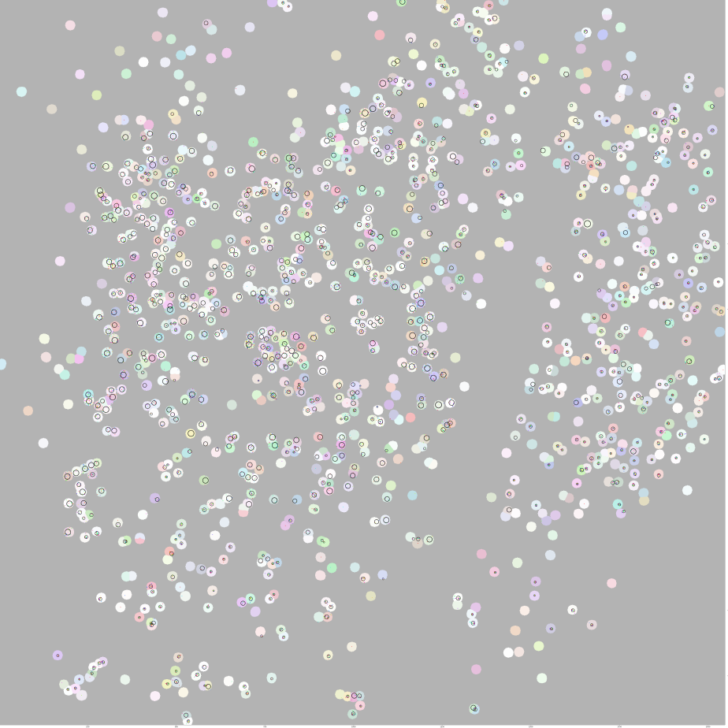
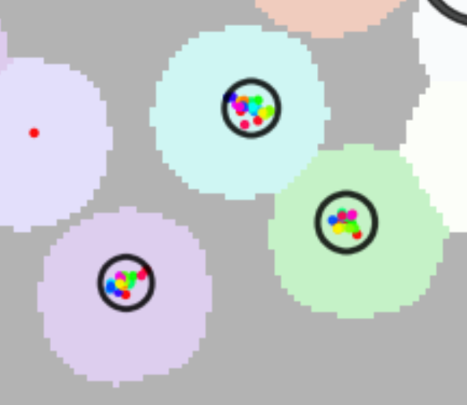
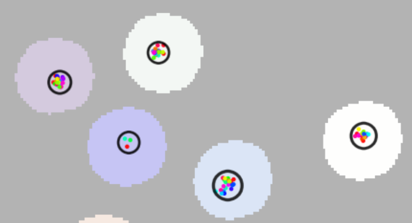

# build_traces

## Invoke
Inside the folder with your input data, run:
```shell
pyhim -C build_traces
```

## Inputs

|Name shape|Quantity|Mandatory|Description|
|---|---|---|---|
|infoList.json|1|Yes|Parameter file.|

## Outputs
|Name shape|Quantity|Description|
|---|---|---|
||||


## Relevant options

Parameters to run this script will be read from the ```buildsPWDmatrix``` field of ```infoList.json```.

```
"tracing_method": ["masking","clustering"], # list of methods it will use
"mask_expansion": 8,# number of pixels masks will be expanded to assign localizations
"masks2process":{"nuclei":"DAPI","mask1":"mask0"}, # masks identities to process
"KDtree_distance_threshold_mum": 1,# threshold distance used for KDtree clustering
```


## **(Invoke)**

To run this function exclusively, run *pyHiM* using the ```-C build_traces``` argument. This function will find and process all the localization files in the `segmentedObjects` folder. The output of `register_localizations` will be saved in the `buildsPWDmatrix` folder with the name starting with `Trace_`. The reminder of the name will contain the kind of operation run (mask/KDtree) the identity of the mask (e.g. mask0, DAPI), and whether localizations used were from a *2D* or a *3D* analysis. 


Output images:

- `_XYZ_ROI*.png`

|  | full image | zoomed images |
| --- |   ---- | --- |
| 3D **mask** |  ||
| 3D **mask** |  ||
| 3D **KDtree** |  ||
