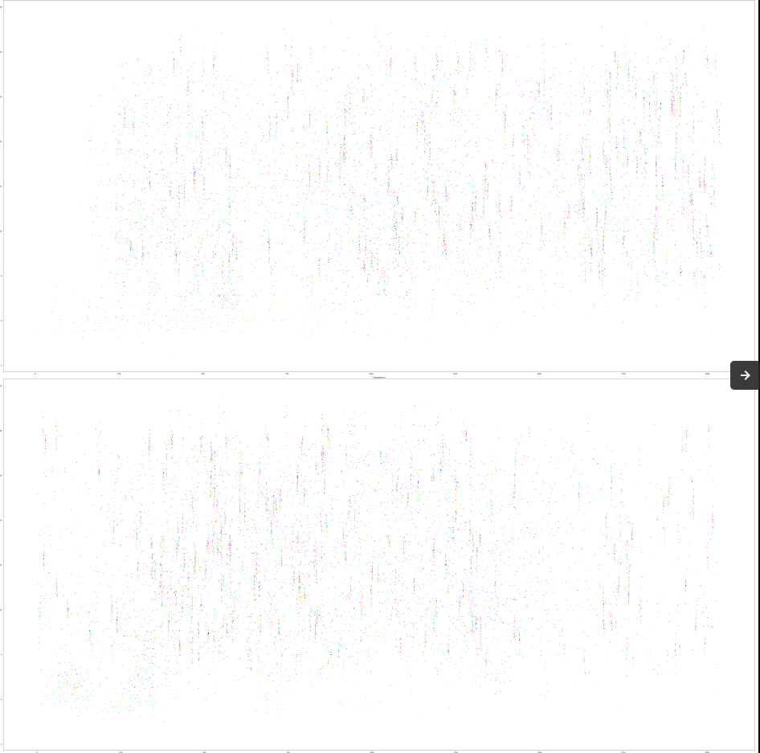

# register_localizations

## Invoke
Inside the folder with your input data, run:
```shell
pyhim -C alignImages
```

## Inputs

|Name shape|Quantity|Mandatory|Description|
|---|---|---|---|
|infoList.json|1|Yes|Parameter file.|

## Outputs
|Name shape|Quantity|Description|
|---|---|---|
||||

## Relevant options

Parameters to run this script will be read from the ```buildsPWDmatrix``` field of ```infoList.json```.

```
"toleranceDrift": 1 # tolerance drift in pixels. Above this value localizations will not be locally registered
```

 ## **(Invoke)**

To run this function exclusively, run *pyHiM* using the ```-C register_localizations``` argument. This function will find and process all the localization files in the `segmentedObjects` folder. To avoid overwriting data, existing files will be renamed with the extension `_version_n` where `n`will be incremented from run to run. The output of `register_localizations` will be saved with the original localizations filename. A comment in the header will be added to indicate that a *registration* operation was run on this file. `register_localizations` **will not be run on files that were previously registered.**


outputs images:

- `_registered_barcode_stats.png`
- `_registered_barcode_localizations_ROI*.png`

| statistics of registration                                   | localization map                                             |
| ------------------------------------------------------------ | ------------------------------------------------------------ |
|  |  |
|  |  |
