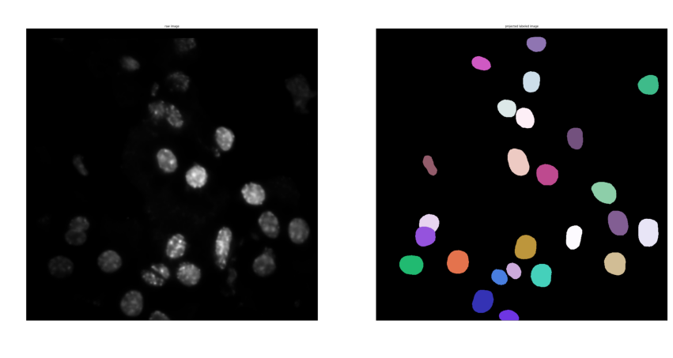

# segmentMasks3D
*Segments masks in 3D*

## Invoke
Inside the folder with your input data, run:
```shell
pyhim -C segmentMasks3D
```



## Inputs

|Name shape|Quantity|Mandatory|Description|
|---|---|---|---|
|infoList.json|1|Yes|Parameter file.|
|<image_name>.tif|2..n|Yes|3D images|

## Outputs
|Name shape|Quantity|Description|
|---|---|---|
|*_3Dmasks.npy|2..n||


A 3D mask segmentation produces two outputs saved in the `segmentedObjects` folder:

```
scan_002_mask0_002_ROI_converted_decon_ch01.tif_3Dmasks.png
scan_002_mask0_002_ROI_converted_decon_ch01._3Dmasks.npy
```

The PNG file is a representation of the raw image and the segmented objects.

The NPY file is a 3D labeled numpy array containing the segmented objects. The file name is constructed using the original root filename with the tag `_3DMasks`.

_Warning_: This mode operates in 3D, therefore the Startdist network provided **must be** in 3D.

## Relevant options
Most of the parameters are shared with ```segmentMasks```, except for the following:

|Name|Option|Description|
|:-:|:-:|:-:|
|stardist_basename3D| | Folder containing 3D AI models|
|stardist_network3D| | Name of the 3D network| 
