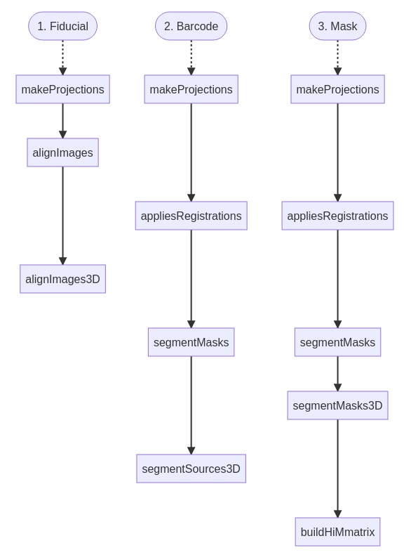

# Overview

## High level view

*pyHiM* software is running as a pipeline, executing sequentially a series of pre-defined routines.
These routines can be classified into 5 groups:


1. **Preprocessing:** Organization and formatting of the input data before proceeding with the analysis (e.g. registration or calculation of 2D projection).
2. **Identification:** Image segmentation (e.g. detection of FISH spots, segmentation of nuclei or cells, etc.) and calculation of the 3D-coordinates.
3. **Matching:** Addressing each detection to a unique mask.
4. **Postprocessing:** Formatting output data to make post-analysis easier for the user (ex: pairwise distance matrices).
5. **Visualization:** Indicating live-progress and results to the user (as `.png` images and `.md` file).

```{note}
Each step can be optimized with **parallel computations** thanks to [Dask](https://www.dask.org/) package.
To use it, see [`--threads` argument](../getting_started/typical_run.md#optional-arguments).
```

## Data set

To run the default pipeline, *pyHiM* needs two types of data:
- A dictionary of initialization parameters, named `infoList.json`
- 3D images in TIFF format (extension: `.tif` or `.tiff`). 

Four types of images are accepted and will be processed in the following order:
1. **Fiducial**
2. **Barcode**
3. **Mask** (like DAPI)
4. RNA (optional)

```{note}
These types of images are called labels.
**Labels 1,2 & 3 are mandatory for running the default analysis pipeline.**
```

## Default *pyHiM* flow

The default pipeline is composed of the following routines:

1. [**makeProjections:**](modules/preprocessing/make_projections.md) Projects all 3D images in 2D.
2. [**alignImages:**](modules/preprocessing/align_images.md) Computes the best shift to align all 2D fiducials.
3. [**appliesRegistrations:**](modules/preprocessing/applies_registrations.md) Shifts 2D barcodes, masks and RNA according to the transformation computed at the `alignImages` step.
4. [**alignImages3D:**](modules/preprocessing/align_images_3d.md) Takes 2D aligned fiducial images and finds the best shift along the Z-axis. This shift will be applied on the 3D segmented barcodes at `buildHiMmatrix` step.
5. [**segmentMasks:**](modules/identification/segment_masks.md) Segments 2D aligned barcodes and masks.
6. [**segmentMasks3D:**](modules/identification/segment_masks_3d.md) Segments masks in 3D.
7. [**segmentSources3D:**](modules/identification/segment_sources_3d.md) Applies 2D shift, computed at `alignImages` step, to 3D barcodes. Then segments them in 3D.
8. [**buildHiMmatrix:**](modules/building_traces.md#build-traces-old-method) Filters the segmentation results, associates barcode coordinates with the relevant mask and calculates the pairwise distance (PWD) matrix for each mask.

```{note}
You can find a description of all routines inside [next section](fundamental.md).
```

Some routines only involve specific labels:


