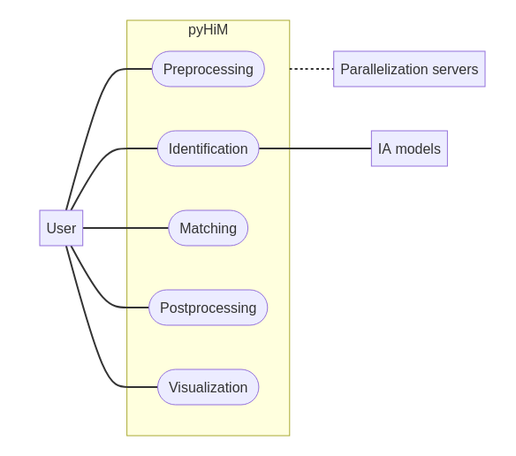

# Pipeline overview

## Global structure

*pyHiM* software is running as a pipeline, executing sequentially a series of pre-defined routines. The default pipeline is composed of 5 main features, each dedicated to a specific application:

1. **Preprocessing** = Organization and formatting of the input data before proceeding to the actual analysis (e.g. registration or calculation of 2D projection)
2. **Identification** = image segmentation (e.g. detection of FISH spots, segmentation of nuclei or cells, etc.) and calculation of the 3D-coordinates
3. **Matching** = address each detection to a specific mask
4. **Postprocessing** = format output data to make post-analysis easier for the user
5. **Visualization** = indicate live-progress and results to the user

*Each step can be optimized with **parallel computations** using the Dask package.*

## Default *pyHiM* flow

To run default pipeline, *pyHiM* need two kinds of data:
- A dictionary of initialization parameters, named `infoList.json`
- 3D images with TIFF format. Four types of images are accepted and will be processed in the following order:
	1. Fiducial
	2. Barcode
	3. Mask (like DAPI)
	4. RNA (optional)

These types of images are called labels. **Note that labels 1,2 & 3 are mandatory for running the default analysis pipeline.**

The default pipeline consists in a sequence of seven basic routines:

1. **makeProjections**: Project all 3D images in 2D 
2. **alignImages**: Compute the best shift to align all 2D fiducials
3. **appliesRegistrations**: Shift 2D barcodes, masks and RNA according to the transformation computed at the alignImages step
4. **alignImages3D**: Take 2D aligned fiducial images and find the best shift along the Z-axis. This shift will be applied on the 3D segmented barcodes at buildHiMmatrix step.
5. **segmentMasks**: Segments 2D aligned barcodes and masks
6. **segmentSources3D**: Applies 2D shift, computed at alignImages step, to 3D barcodes. Then, segments them in 3D.
7. **buildHiMmatrix**: Filter the segmentation results, associate barcode coordinates with the right mask and calculate the pairwise distance (PWD) matrix for each mask.

The detailed pipeline organization is summarized in the table below:

|Command|Fiducial|Barcode|DAPI|RNA|
|:-:|:-:|:-:|:-:|:-:|
|makeProjections|1|4|8|12|
|alignImages|2||||
|appliesRegistrations||5|9|13|
|alignImages3D|3||||
|segmentMasks||6|10||
|segmentSources3D||7|||
|buildsPWDmatrix|||11||

## Input / Output data

Here is a table summarizing the type of input and output data for each routine:

|Routine|Input|Output|
|:-:|---|---|
|**makeProjections**|3D_raw.tif|2D_raw.npy|
|**alignImages**|2D_raw.npy + 2D_reference.npy|alignImages.ecsv|
|**AppliesRegistrations**|2D_raw.npy + alignImages.ecsv|2D_registered.npy|
|**alignImages3D**|3D_raw.tif + 3D_reference.tif + alignImages.ecsv|alignImages_block3D.ecsv|
|**segmentMasks**|2D_registered.npy|segmented_barecode.ecsv + segmented_mask.npy|
|**segmentSources3D**|3D_raw.tif + alignImages.ecsv|3D_segmented_barcode.ecsv|
|**buildHiMmatrix**|segmented_barcode.ecsv + segmented_mask.npy + alignImages_block3D.ecsv + 3D_segmented_barcode.ecsv|PWDMatrix.ecsv + 3D_PWDMatrix.ecsv|