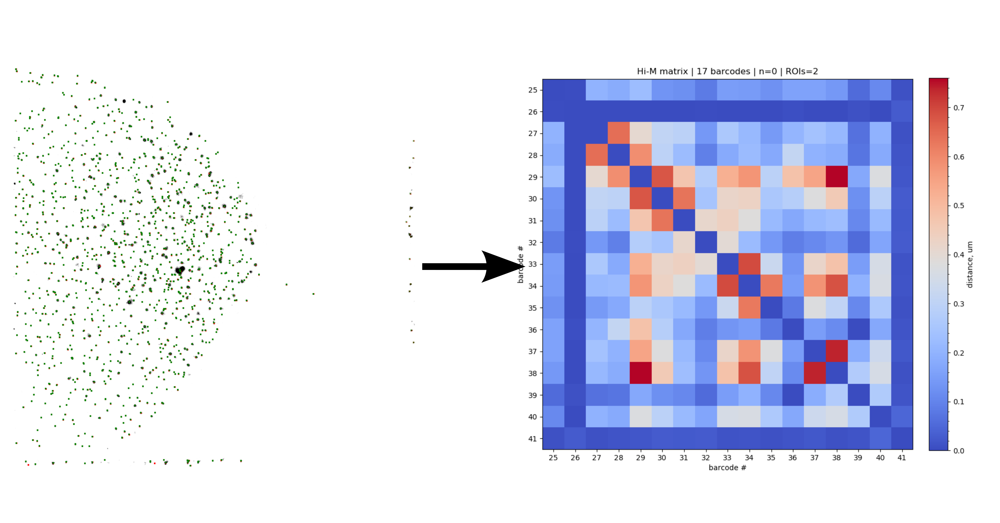

# Introduction

**Welcome to pyhiM !**

*pyHiM* is a software package designed to pre-process and analyze **multiplexed DNA-FISH data** (e.g. Hi-M), as well as to visualize the results. For more information about Hi-M please see the references below.

A minimal HiM set of data contains:

- images of nuclei for a given region of interest (ROI)
- images of DNA-FISH barcodes acquired in different hybridization cycles for the same ROI as for the nuclei.
- fiducial images for both nuclei and barcodes acquired simultaneously with the images above (typically in a different color).


*pyHiM* has specific modules that allow the user to:

- register nuclei and barcode images to remove or minimize drift.
- segment nuclei
- segment and localize barcodes
- construct chromatin traces
- build single-trace and ensemble pair-wise distance maps




**References**

For more information on Hi-M, please see the following resources:

- [Hi-M protocol](https://github.com/NollmannLab/HiM_protocol)
- [Hi-M method](https://www.cell.com/molecular-cell/fulltext/S1097-2765(19)30011-5)
- [A recent Hi-M application of Hi-M](https://www.nature.com/articles/s41588-021-00816-z)

## Main goals

In the context of structural biochemistry, *pyHiM* software provides the tools for **processing multiplexed DNA-FISH data** produced **by HiM experiments** as well as the **visualization** tools to explore the results.

Basic concept of this software is to **calculate the 3D positions** of a set of DNA-loci, referred to as barcodes. Data acquisition is performed sequentially, in a series of **cycles** combining the acquisition of a single barcode with a **fiducial marker** common to all cycles and later used for drift correction. Each set of barcode coordinates will be associated with its corresponding cell by using masks (segmented nuclei stained with DAPI for instance). At the end of the analysis, *pyHiM* will output several files describing the composition (barcodes), localization and 3D-coordinates of all individual traces detected.

*Optionally, pyHiM also provides a basic way to detect a **single type of RNA** but it doesn’t include processing for multiple RNA species or data for proteins-FISH.*

## Global structure

*pyHiM* software is running as a pipeline, executing sequentially a series of pre-defined routines. The default pipeline is composed of 5 main features, each dedicated to a specific application:

Features in the default pipeline can be classified into five categories:
1. **Preprocessing** = Organization and formatting of the input data before proceeding to the actual analysis (e.g. registration or calculation of 2D projection)
2. **Identification** = image segmentation (e.g. detection of FISH spots, segmentation of nuclei or cells, etc.) and calculation of the 3D-coordinates
3. **Matching** = address each detection to a specific mask
4. **Postprocessing** = format output data to make post-analysis easier for the user
5. **Visualization** = indicate live-progress and results to the user

*Each step can be optimized with **parallel computations** using the Dask package.*

The use cases of *pyHiM* can be summarized in this diagram below:

```{mermaid}
flowchart LR
subgraph uc[pyHiM]
	f1([Preprocessing])
	f12([Identification])
	f7([Matching])
	f17([Postprocessing])
	f9([Visualization])
end
Biologist --- f1 & f12 & f7 & f17 & f9
uc -.- a2[Parallelization servers]
f12 --- a1[IA models]
```